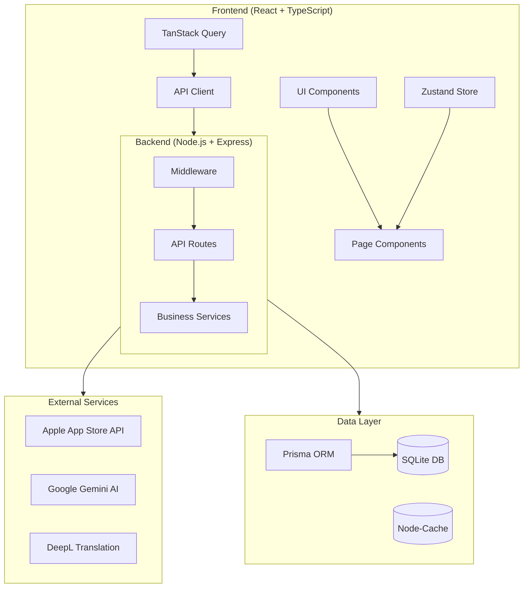
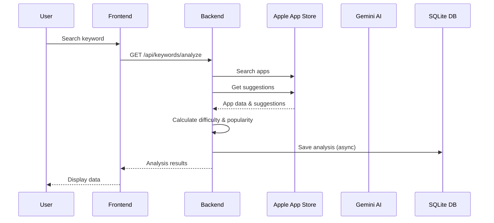

# ASO Keyword Research Platform - Project Understanding

## Project Overview

This is a **full-stack App Store Optimization (ASO) platform** with AI-powered keyword research capabilities. It's designed to help app developers and marketers optimize their App Store presence through comprehensive keyword analysis, competitor research, and AI-driven insights.

## Architecture



## Technology Stack

### Backend
| Component | Technology |
|-----------|------------|
| Runtime | Node.js 18+ (ES Modules) |
| Framework | Express.js |
| Database | SQLite with Prisma ORM |
| Caching | node-cache |
| AI | Google Gemini API |
| Translation | DeepL API |
| Security | Helmet, CORS, Rate Limiter |
| Logging | Winston |

### Frontend
| Component | Technology |
|-----------|------------|
| Framework | React 19 + TypeScript |
| Build Tool | Vite 7 |
| Routing | React Router v7 |
| Styling | Tailwind CSS v4 |
| State Management | Zustand (client), TanStack Query (server) |
| Charts | Recharts |
| Icons | Lucide React |
| HTTP Client | Axios |

## Database Schema (12 Models)

### Core Analytics Models
1. **KeywordAnalysis** - Historical keyword metrics (popularity, difficulty, competitors)
2. **RankingHistory** - App ranking positions over time
3. **App** - Cached app information from App Store

### AI Generation History
4. **AIKeywordSuggestion** - AI-generated keyword suggestions
5. **AICompetitorAnalysis** - Competitor gap analysis results
6. **AIMetadataOptimization** - Optimized metadata generations
7. **AIIntentAnalysis** - Keyword intent categorization

### User Activity & Tracking
8. **SearchHistory** - All API requests for analytics
9. **SavedSearch** - User-saved searches and favorites
10. **TrackedKeyword** - Keywords users are tracking
11. **SavedAppIdea** - Saved app concepts from opportunity finder

### Utility
12. **TranslationCache** - Translation results cache
13. **OpportunityDiscovery** - Discovered keyword opportunities

## API Endpoints

### Keywords (`/api/keywords`)
- `GET /analyze` - Analyze single keyword
- `POST /analyze-bulk` - Analyze multiple keywords
- `GET /suggestions` - Get keyword suggestions
- `GET /long-tail` - Find long-tail opportunities
- `GET /track/:appId` - Track keyword ranking
- `GET /compare-countries` - Compare across countries

### Apps (`/api/apps`)
- `GET /search` - Search App Store
- `GET /:appId` - Get app details
- `GET /:appId/keywords` - Extract app keywords
- `GET /top/:category` - Get top apps
- `GET /rankings/:keyword` - Get keyword rankings
- `GET /suggestions/:term` - Get search suggestions

### AI (`/api/ai`)
- `POST /suggest-keywords` - AI keyword suggestions
- `POST /analyze-competitors` - Competitor analysis
- `POST /optimize-metadata` - Optimize app metadata
- `POST /analyze-intent` - Analyze search intent
- `POST /localize-keywords` - Localize for markets
- `POST /translate` - Translate keywords
- `GET /languages` - Supported languages

### Opportunities (`/api/opportunities`)
- `POST /discover` - Discover keyword opportunities
- `POST /app-ideas` - Generate app concept ideas

### History (`/api/history`)
- `GET /trending` - Trending keywords
- `GET /ai-generations` - Past AI generations
- `GET /keywords/:keyword` - Keyword history
- `GET /rankings/:appId` - Ranking history

### Tracked (`/api/tracked`)
- `GET /keywords` - Get tracked keywords
- `POST /keywords` - Track keywords
- `DELETE /keywords/:id` - Remove tracked keyword
- `GET /app-ideas` - Get saved app ideas
- `POST /app-ideas` - Save app idea

## Frontend Pages

| Route | Component | Purpose |
|-------|-----------|---------|
| `/` | Dashboard | Main overview with stats |
| `/keywords` | KeywordResearch | Keyword analysis tool |
| `/opportunities` | OpportunityFinder | Find keyword opportunities |
| `/apps` | MyApps | App explorer |
| `/apps/:appId` | AppDetails | Single app details |
| `/tracking` | MyTracking | Tracked keywords & apps |
| `/competitors` | CompetitorAnalysis | Competitor research |
| `/ai-tools` | AITools | AI-powered features |
| `/history` | History | Search history |
| `/metadata` | MetadataOptimizer | Optimize app metadata |
| `/intent` | IntentAnalysis | Keyword intent analysis |

## Key Services

### KeywordService (`src/services/keyword.service.js`)
- Calculates keyword difficulty (0-100) based on:
  - Average rating of top 10 apps (15%)
  - Average rating count (35%)
  - Top 3 app strength (30%)
  - Competitor count (20%)
- Estimates popularity (5-100) using:
  - App Store search suggestions position
  - Search results quality
  - Keyword length

### AIService (`src/services/ai.service.js`)
- Google Gemini integration
- Keyword suggestion generation
- Competitor analysis with gap identification
- Metadata optimization (title, subtitle, keywords)
- Intent analysis (navigational, informational, transactional, commercial)
- Localization for different markets
- App concept generation

### AppStoreService (`src/services/appStore.service.js`)
- iTunes API integration
- App search and lookup
- Search suggestions from Apple
- Top apps by category
- Keyword extraction from app metadata
- Supports 50+ countries

### OpportunityService (`src/services/opportunity.service.js`)
- Discovers keyword opportunities by category
- AI-powered keyword generation
- Opportunity scoring (popularity/difficulty ratio)
- Filterable by popularity, difficulty, competition

## Configuration

### Environment Variables
```env
PORT=3000
NODE_ENV=development
DATABASE_URL="file:./prisma/aso.db"
GEMINI_API_KEY=your_google_gemini_api_key
DEEPL_API_KEY=your_deepl_api_key
CACHE_TTL_SECONDS=3600
RATE_LIMIT_WINDOW_MS=60000
RATE_LIMIT_MAX_REQUESTS=100
CORS_ORIGIN=*
```

### Frontend Environment
```env
VITE_API_URL=http://localhost:3000/api
```

## Key Features

### Backend Features
- Multi-country support (50+ App Store regions)
- Built-in caching for optimal performance
- Rate limiting (100 requests/minute default)
- Request analytics tracking
- Historical data persistence
- Non-blocking database saves

### Frontend Features
- Dark mode UI with warm orange theme
- Responsive design (mobile & desktop)
- Real-time data with TanStack Query
- Data visualization with Recharts
- Persistent state with Zustand

## Data Flow



## File Structure

```
ai-keywords-search/
├── src/                          # Backend source
│   ├── config/                   # Configuration
│   ├── db/                       # Prisma client
│   ├── middleware/               # Express middleware
│   ├── routes/                   # API routes
│   ├── services/                 # Business logic
│   └── utils/                    # Utilities
├── prisma/                       # Database schema & migrations
├── frontend/                     # React frontend
│   ├── src/
│   │   ├── components/           # UI components
│   │   ├── pages/                # Route pages
│   │   ├── lib/                  # API client & utils
│   │   └── store/                # Zustand store
│   └── public/                   # Static assets
└── .env.example                  # Environment template
```

## Development

### Start Backend
```bash
npm install
npm run dev          # Port 3000
```

### Start Frontend
```bash
cd frontend
npm install
npm run dev          # Port 5173
```

### Database Migration
```bash
npx prisma migrate dev --name init
```

## Deployment Notes

- Frontend builds to static files with `npm run build`
- Backend runs as Node.js server
- SQLite database file persists in `prisma/aso.db`
- Consider using PostgreSQL for production at scale
- API rate limiting configured per IP
- CORS enabled for frontend domain
